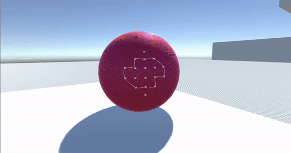

# UnitySpline
 >Once upon a time, there was a spline.
 >A spline who was only 60 lines. 
>
 >Unity had none, 
 >and that's no fun
>
 >So I went and added mine.
>
 >It does numbers and colors 
 >and vectors just fine
>
 >But don't get too wild 
 >when using unsigned
>
 >I made only one weight scheme,
 >So please don't hate me
>
 >If your output becomes four-billion, two-hundred ninety-four million, nine-hundred sixty-seven thousand, two-hundred ninety
 >and five
  

## Requirements
Needs .NET 4.x for generic reasons
To enable on your project, navigate to 

> File > Project Settings > Player > Other Settings > Configuration > Api Compatibility Level* 

and then select `.NET 4.x`


## Usage
Interpolate a rainbow: 
```
private Spline<Color> rainbow = new Spline<Color>(new Color[]{Color.red, 
                                                              new Color(255.0f / 255.0f, 127.0f / 255.0f, 0), 
                                                              Color.yellow, 
                                                              Color.green, 
                                                              Color.blue, 
                                                              new Color(75.0f / 255.0f, 0.0f, 130.0f / 255.0f),
                                                              new Color(139.0f / 255.0f , 0, 255.0f / 255.0f)});
```

Make it a looped spline by readding the first element:
```
rainbow.AddPoint(Color.Red);
```
Get a point on the spline, given a value between 0 and 1
```
Color newColor = rainbow.GetPoint(0.5f);
```
